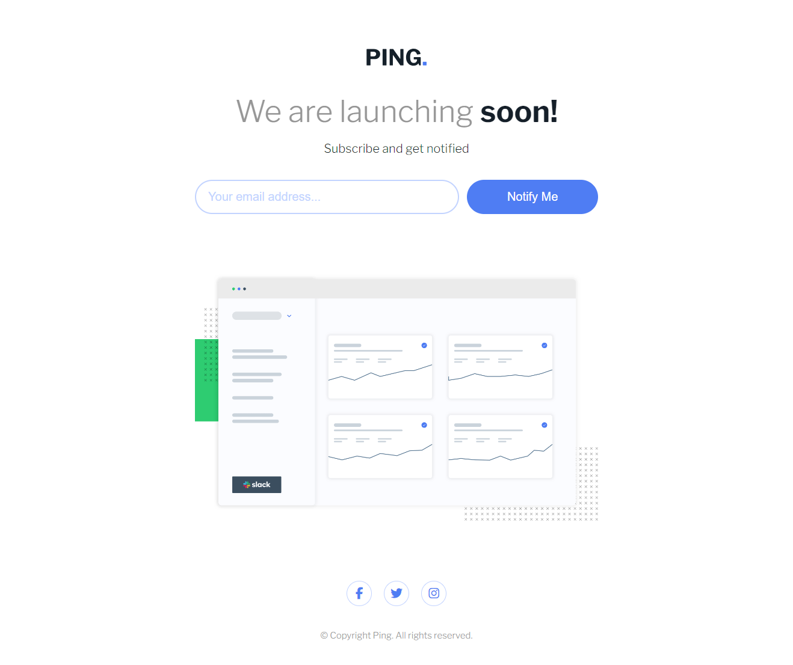

# Frontend Mentor - Ping coming soon page solution

This is a solution to the [Ping coming soon page challenge on Frontend Mentor](https://www.frontendmentor.io/challenges/ping-single-column-coming-soon-page-5cadd051fec04111f7b848da). Frontend Mentor challenges help you improve your coding skills by building realistic projects. 

## Table of contents

- [Overview](#overview)
  - [The challenge](#the-challenge)
  - [Screenshot](#screenshot)
  - [Links](#links)
- [My process](#my-process)
  - [Built with](#built-with)
- [Author](#author)

## Overview

The Ping coming soon page challenge from front end mentor is a web development exercise that consists of creating a simple pre-launch page for a website monitoring service called Ping. The page must have a responsive design that adapts to different screen sizes, an input field for users to submit their email addresses, and a button to validate the email and show a success or error message. The page must also have social media icons for users to follow Ping on digital platforms. The challenge is aimed at beginners in HTML, CSS and JavaScript, and has the goal of testing the skills of layout, styling, interaction and accessibility of the developers. The challenge is part of a platform called Frontend Mentor, that offers several practical projects to practice and improve the front-end skills.

### The challenge

Users should be able to:

- View the optimal layout for the site depending on their device's screen size
- See hover states for all interactive elements on the page
- Submit their email address using an `input` field
- Receive an error message when the `form` is submitted if:
	- The `input` field is empty. The message for this error should say *"Whoops! It looks like you forgot to add your email"*
	- The email address is not formatted correctly (i.e. a correct email address should have this structure: `name@host.tld`). The message for this error should say *"Please provide a valid email address"*

### Screenshot

### Links

- Solution URL: [https://www.frontendmentor.io/solutions/responsive-ping-coming-soon-page-oEl9qmBZ4Q](https://www.frontendmentor.io/solutions/responsive-ping-coming-soon-page-oEl9qmBZ4Q)
- Live Site URL: [https://ping-coming-soon-page-tau.vercel.app/](https://ping-coming-soon-page-tau.vercel.app/)

### Built with

- Semantic HTML5 markup
- CSS custom properties
- Flexbox

## Author

- Frontend Mentor - [@lucasbsand](https://www.frontendmentor.io/profile/lucasbsand)
